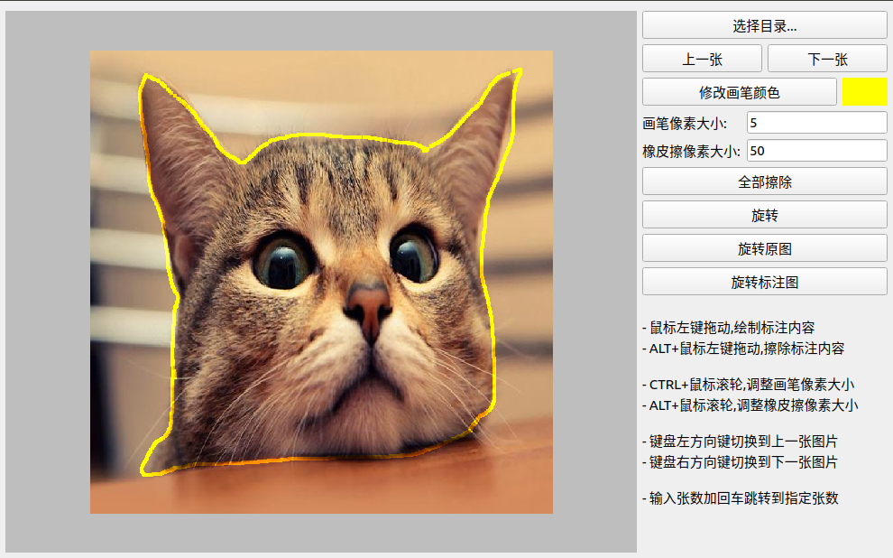

## 用法
1. 打开工具,选择需要标注的目录, 按下鼠标左键绘制需要标注的内容


## 打包成exe文件

- 文件版本信息文件模板获取, 打开powershell然后输入如下命令获取记事本程序的版本信息文件,修改相关信息即可
```
(py36) C:\Users\logan>pyi-grab_version C:\Windows\system32\notepad.exe
```

- 运行打包命令指定图标和版本信息文件.
```
pyinstaller  --onefile --windowed --icon=main.ico -n "掩膜标注工具" --version-file=file_version_info.txt --clean main.py
```


## 截图
在操作界面使用鼠标绘制需要标注的内容



标注结果存储在对应目录下面的mask目录下面


